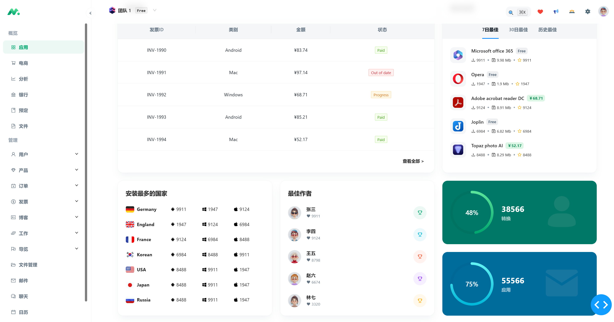
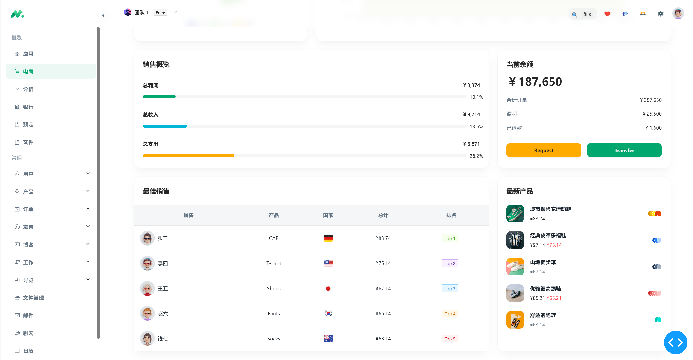
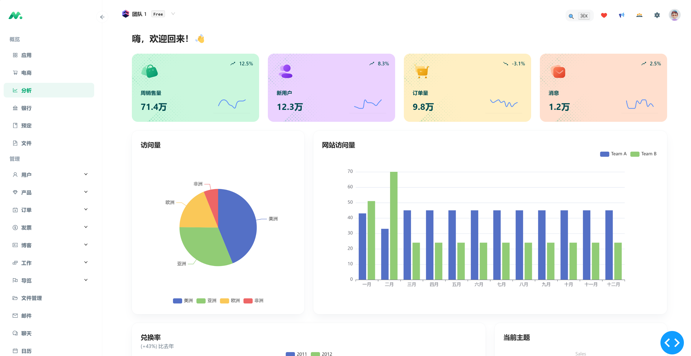
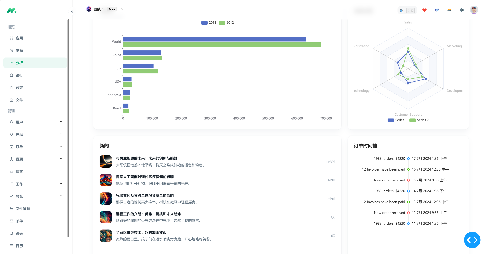
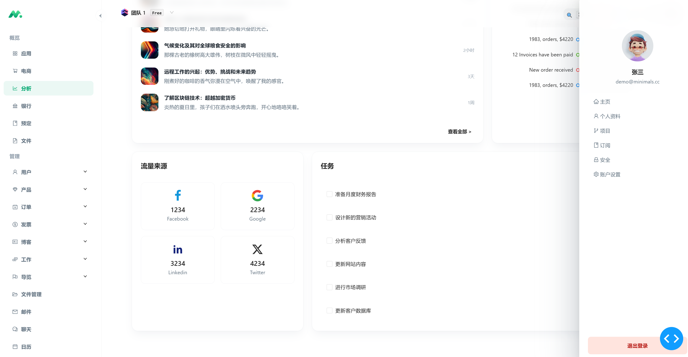
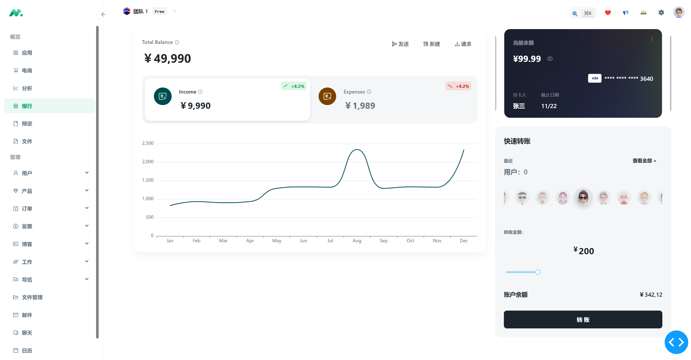

<p align="center">
	
</p>
<h1 align="center" style="margin: 30px 0 30px; font-weight: bold;">Dash-FastAPI-Minimal</h1>
<h4 align="center">基于Dash+FastAPI前后端分离的Minimal实现</h4>
<p align="center">
	<a href="https://gitee.com/insistence2022/dash-fastapi-admin"></a>
</p>

## 简介

Dash-FastAPI-Minimal是[Mui-Minimal](https://mui.com/store/previews/minimal-dashboard/)的模仿实现

## 效果

<table>
    <tr>
        <td></td>
        <td></td>
    </tr>
    <tr>
        <td></td>
        <td></td>
    </tr>
    <tr>
        <td></td>
        <td></td>
    </tr>
    <tr>
        <td></td>
        <td></td>
    </tr>
    <tr>
        <td></td>
        <td></td>
    </tr>
</table>

## 使用

```bash
# 克隆项目
git clone https://github.com/Lanrzip/Dash-FastAPI-Minimal.git

# 进入项目目录
cd Dash-FastAPI-Minimal

# 安装依赖
pip install -r requirements.txt
pip install lanrzip_dash_components-0.0.1.tar.gz

# 启动前端
python front-end\app.py

# 启动后端
python back-end\app.py
```
